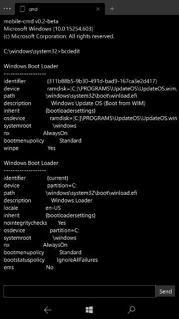

# Command Prompt for W10M

Easily access 'Windows Command Prompt' on supported Windows Mobile devices, this makes use of Telnet to make the connection

  

## Requirements:
- Windows 10 Mobile 14393 and up.
- [CMD Injected](https://github.com/fadilfadz01/CMD.Injector) to the device.
- Loopback connection enabled (details in-app)

### Acknowledgements:
- [BAstifan](https://github.com/basharast) for the TelnetClient class.
- [Fadil Fadz](https://github.com/fadilfadz01) for CMD Injector and minor help with handling stout and sterr
