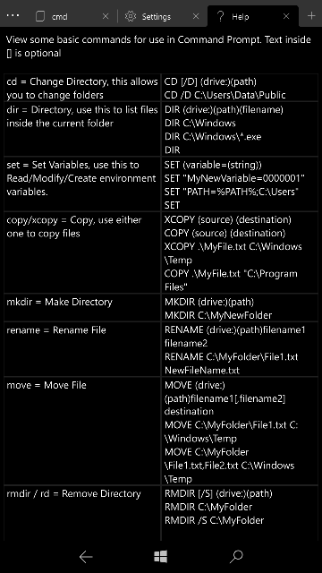

# mobile-cmd - A modern command prompt app for Windows 10 Mobile

Easily access 'Windows Command Prompt' on supported Windows Mobile devices, this makes use of Telnet to make the connection

  

## Requirements:
- Windows 10 Mobile Build 15063 and higher.
- [CMD Injected](https://github.com/fadilfadz01/CMD.Injector) to the device.
- Loopback connection enabled (details in-app)

## Known issues:
- (Should be fixed) Sometimes the session doesn't load properly, I'm trying to see why, but close and re-open. If this persists then reinstall the app
- Only simple Scripts are supported, i.e no user input needed.

### Acknowledgements:
- [BAstifan](https://github.com/basharast) for the TelnetClient class.
- [Fadil Fadz](https://github.com/fadilfadz01) for CMD Injector and minor help with handling stout and sterr
